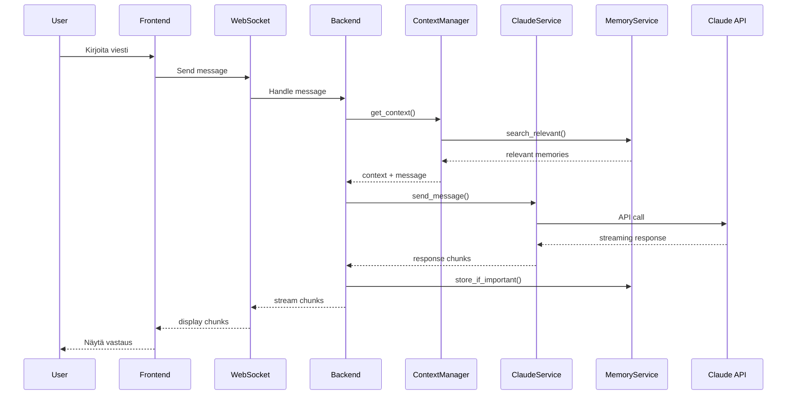

# PROCESS_SPEC_Writing

> **Versio:** 1.8  
> **Päivitetty:** 2025-12-14  
> **Tiedosto:** PROCESS_SPEC_Writing_v1_8.md  
> **Edellinen:** v1.7 (2025-12-04)  
> **Projekti:** Claude API -suunnittelutyökalu

---

## Muutokset v1.7 → v1.8

| Muutos | Kuvaus | Lähde |
|--------|--------|-------|
| ✅ **Research Methodology viittaus** | Phase 2 ja 8 viittaavat PROCESS_Research_Methodology.md:iin | Session #14 |
| ✅ **Liittyvät dokumentit** | Lisätty osio dokumentin loppuun | Session #14 |

---

## Muutokset v1.6 → v1.7

| Muutos | Kuvaus | Lähde |
|--------|--------|-------|
| ✅ **Audit Trail -ketju** | REQ → AC → Task → Test Scenario → Test | Session #13 |
| ✅ **REQ + AC -rakenne** | Acceptance Criteria integroitu SPEC-templateen | E8 |
| ✅ **Task Decomposition** | Taskit + Test Scenariot TECH_SPEC-templateen | E9 |
| ✅ **Traceability Matrix** | Progressiivinen jäljitettävyysmatriisi | E10 |
| ✅ **"Read Full Source" -sääntö** | Web fetch ennen johtopäätöstä | E1 |
| ✅ **"Research Slop" -varoitus** | AI-hallusinaatioiden tiedostaminen | E2 |
| ✅ **Data Flow -ohje** | Mermaid-diagrammi arkkitehtuuriin | E7 |
| ✅ **Dokumentoinnin selkeysperiaate** | Yksiselitteisyys, riittävä yksityiskohtaisuus | Session #13 |

---

## Dokumentoinnin perusperiaate (v1.7)

> **"Mieluummin liikaa tekstiä kuin liian vähän."**

Jokainen dokumentti kirjoitetaan niin, että:

- **Yksiselitteinen**: Ei tulkinnanvaraa, ei oletuksia
- **Ymmärrettävä**: Uusi lukija ymmärtää ilman lisäkontekstia
- **Riittävän yksityiskohtainen**: Jälkeenpäin syntyy selvä ymmärrys tarkoituksesta
- **Itsenäinen**: Ei viittauksia "katso edellinen versio"

**Miksi tämä on kriittistä:**

- AI-konteksti vaihtuu sessioiden välillä
- Dokumentit ovat "muisti" joka säilyy
- Epäselvä dokumentaatio johtaa virheellisiin tulkintoihin myöhemmin

---

## Audit Trail -ketju (v1.7) ⭐ KRIITTINEN UUDISTUS

### Miksi audit trail on tärkeä?

Audit trail mahdollistaa:

1. **Täydellisen testattavuuden** - jokainen vaatimus on jäljitettävissä testiin
2. **Kattavuuden varmistuksen** - nähdään onko kaikki toteutettu
3. **Virheiden juurisyyn löytämisen** - voidaan palata ketjussa taaksepäin
4. **Laadunvarmistuksen** - review voi tarkistaa ketjun eheyden

### Audit trail -hierarkia

```
┌─────────────────────────────────────────────────────────────────┐
│                    AUDIT TRAIL -KETJU                           │
├─────────────────────────────────────────────────────────────────┤
│                                                                 │
│  REQ-01 (Requirement)           ← SPEC-vaihe                   │
│    │                                                            │
│    ├── AC-01 (Acceptance Criterion)                            │
│    │     │                                                      │
│    │     └── Task-01            ← TECH_SPEC-vaihe              │
│    │           │                                                │
│    │           ├── TS-01.1 (Test Scenario, Happy Path)         │
│    │           ├── TS-01.2 (Test Scenario, Edge Case)          │
│    │           └── TS-01.3 (Test Scenario, Error Case)         │
│    │                 │                                          │
│    │                 └── test_xxx() ← CODE-vaihe (TDD)         │
│    │                                                            │
│    ├── AC-02                                                    │
│    │     └── Task-02                                           │
│    │           └── TS-02.1, TS-02.2...                         │
│    │                                                            │
│    └── AC-03                                                    │
│          └── ...                                                │
│                                                                 │
└─────────────────────────────────────────────────────────────────┘
```

### Termien määritelmät

| Termi | Määritelmä | Abstraktiotaso | Vaihe |
|-------|------------|----------------|-------|
| **REQ** (Requirement) | Toiminnallinen vaatimus, kuvaa MITÄ järjestelmän pitää tehdä | Korkea | SPEC |
| **AC** (Acceptance Criterion) | Kriteeri jolla vaatimus todetaan täytetyksi, vastaa "mistä tiedän että tämä toimii?" | Keski | SPEC |
| **Task** | Tekninen tehtävä joka toteuttaa yhden tai useamman AC:n | Keski-matala | TECH_SPEC |
| **TS** (Test Scenario) | Konkreettinen testitapaus, kuvaa yhden polun (happy/edge/error) | Matala | TECH_SPEC |
| **test_xxx()** | Varsinainen testikoodi joka implementoi Test Scenarion | Toteutus | CODE |

### Nimeämiskonventio

```
REQ-XX      Vaatimus (esim. REQ-01, REQ-02)
AC-XX       Acceptance Criterion (esim. AC-01, AC-02)
Task-XX     Tekninen tehtävä (esim. Task-01, Task-02)
TS-XX.Y     Test Scenario (esim. TS-01.1, TS-01.2)
            XX = AC:n numero, Y = järjestysnumero
```

### Kevyt hybridi -malli: Kuka tekee mitä?

| Vaihe | Kuka | Mitä tekee |
|-------|------|------------|
| **SPEC** | Claude (suunnittelija) | Kirjoittaa REQ + AC |
| **TECH_SPEC** | Claude (suunnittelija) | Kirjoittaa Task + pääskenaariot (TS) kevyellä formaatilla |
| **CODE** | Claude Code | Implementoi annetut TS:t + lisää teknisiä edge caseja TDD:n aikana |
| **Review** | Käyttäjä/Gemini | Tarkistaa että lisäykset ovat linjassa AC:iden kanssa |

**Miksi hybridi?**

- Suunnittelija ymmärtää liiketoimintakontekstin → kirjoittaa pääskenaariot
- Claude Code näkee tekniset yksityiskohdat → täydentää edge caset
- TDD-filosofia: testit kirjoitetaan juuri ennen koodia, ei viikkoja etukäteen

---

## Tiedonhaun kultaiset säännöt (v1.7)

### 1. "Read Full Source" -sääntö

> **PAKOLLINEN:** Älä koskaan luota hakutuloksen snippettiin.  
> Käytä AINA `web_fetch` ja lue koko artikkeli ennen johtopäätöstä.

Hakutuloksen snippet voi olla:

- Kontekstista irrotettu
- Vanhentunut
- Harhaanjohtava

**Oikea prosessi:**

1. `web_search` → löydä relevantit lähteet
2. `web_fetch` → lue KOKO artikkeli
3. Vasta sitten tee johtopäätös ja dokumentoi

### 2. "Research Slop" -varoitus

> **VAROITUS:** AI-generoitu teksti voi olla "polished, articulate,  
> and inspires faith-like confidence" - mutta silti VÄÄRÄ.

**Konkreettiset riskit:**

- Lakitoimistot: keksityt viittaukset → sanktiot
- Konsulttifirmat: virheelliset tilastot → sakot
- Ammattilaiset: uskottavan kuuloinen vale → maineen menetys

**Älä koskaan:**

- Esitä väitteitä ilman lähdettä
- Luota muistiin teknisistä yksityiskohdista
- Oleta että "kuulostaa oikealta" = on oikein

**AINA kun teet väitteen teknologiasta, varmista lähde.**

### 3. Citation Protocol (RESEARCH-dokumenteissa)

Jokainen tekninen väite PITÄÄ merkitä lähteellä:

```markdown
❌ KIELLETTY:
"SQLite-vec tukee HNSW-indeksointia"

✅ VAADITTU:
"SQLite-vec tukee HNSW-indeksointia (Lähde: sqlite-vec GitHub README, 2024)"

TAI formaalimmin:
"SQLite-vec tukee HNSW-indeksointia [1]"
...
## Lähteet
[1] https://github.com/asg017/sqlite-vec - README.md, viitattu 2025-12-04
```

---

## 11-vaiheinen prosessi (päivitetty v1.7)

```
┌─────────────────────────────────────────────────────────────────┐
│                    11-VAIHEINEN SPEC-PROSESSI                   │
├─────────────────────────────────────────────────────────────────┤
│                                                                 │
│  ═══════════════ VALINNAINEN ═══════════════════════════       │
│                                                                 │
│  0. MARKET RESEARCH  Kilpailijat, käyttäjätarpeet (valinnainen)│
│         │            → Katso PROCESS_Market_Research.md        │
│         ▼                                                       │
│  ═══════════════ TOIMINNALLINEN MÄÄRITTELY ═════════════       │
│                                                                 │
│  1. KONTEKSTI        Lue ARCHITECTURE, MASTER, aiemmat SPECit  │
│         │                                                       │
│         ▼                                                       │
│  2. RESEARCH         Tee tiedonhaku (Read Full Source!)        │
│         │            → Katso PROCESS_Research_Methodology.md   │
│         │            → Tallenna RESEARCH_XX.md                 │
│         ▼                                                       │
│  3. SUUNNITTELU      Primitiivi, black box, API                │
│         │                                                       │
│         ▼                                                       │
│  4. SPEC-KIRJOITUS   REQ + AC + Traceability Matrix pohja      │
│         │            → Tallenna SPEC_XX.md                     │
│         ▼                                                       │
│  5. KÄYTTÄJÄ-REVIEW  Jussi arvioi, vastaa avoimiin kysymyksiin │
│         │                                                       │
│         ▼                                                       │
│  6. GEMINI-REVIEW    Toiminnallinen laadunvarmistus            │
│         │                                                       │
│         ▼                                                       │
│  7. SPEC-VIIMEISTELY Korjaukset, tallennus GitHubiin           │
│         │                                                       │
│  ═══════════════ TEKNINEN MÄÄRITTELY ═══════════════════       │
│         │                                                       │
│         ▼                                                       │
│  8. TECH_RESEARCH    Teknologiavalinnat (kirjastot, toteutus)  │
│         │            → Katso PROCESS_Research_Methodology.md   │
│         │            → Tallenna TECH_RESEARCH_XX.md            │
│         ▼                                                       │
│  9. TECH_SPEC        Task Decomposition + Test Scenarios       │
│         │            → Tallenna TECH_SPEC_XX.md                │
│         │            → Päivitä Traceability Matrix             │
│         ▼                                                       │
│  10. GEMINI TECH     Tekninen laadunvarmistus                  │
│         │                                                       │
│         ▼                                                       │
│  11. PÄIVITYKSET     Päivitä MASTER, KEHITYSLOKI, INDEX        │
│         │                                                       │
│         ▼                                                       │
│  → CODE-vaihe alkaa (TDD, katso PROCESS_Testing.md)            │
│                                                                 │
└─────────────────────────────────────────────────────────────────┘
```

---

## Phase 4: SPEC-kirjoitus (päivitetty template v1.7)

### SPEC-dokumentin rakenne

```markdown
# SPEC_XX_Moduulin_Nimi

> **Versio:** 1.0
> **Päivitetty:** YYYY-MM-DD
> **Status:** Draft / Review / Approved
> **Perustuu:** RESEARCH_XX

---

## 1. Yleiskatsaus

[Moduulin tarkoitus, scope, ei-tavoitteet]

---

## 2. Requirements & Acceptance Criteria

### REQ-01: [Vaatimuksen nimi] 🟢

[Vaatimuksen kuvaus - mitä järjestelmän pitää tehdä]

**Acceptance Criteria:**

| AC-ID | Kriteeri | Tyyppi |
|-------|----------|--------|
| AC-01 | [Mistä tiedän että tämä toimii?] | Functional |
| AC-02 | [Toinen kriteeri] | Functional |
| AC-03 | [Virhetilanne käsitellään] | Error |

**Prioriteetti:** MVP (🟢) / Phase 2 (🟡) / Phase 3 (🔵)
**Riippuvuudet:** [Muut moduulit]

---

### REQ-02: [Toinen vaatimus] 🟢

[Kuvaus]

**Acceptance Criteria:**

| AC-ID | Kriteeri | Tyyppi |
|-------|----------|--------|
| AC-04 | [Kriteeri] | Functional |
| AC-05 | [Kriteeri] | Performance |

---

## 3. API-määrittely (Black Box)

[Julkinen rajapinta - mitä muut moduulit näkevät]

---

## 4. Data Model

[Tietorakenteet, primitiivit]

---

## 5. Edge Cases & Error Handling

[Mitä voi mennä pieleen, miten käsitellään]

---

## 6. Turvallisuus

[Uhkamallit, suojaukset]

---

## 7. Suorituskyky

[SLA:t, bottleneckit]

---

## 8. Traceability Matrix (pohja)

*Täydennetään TECH_SPEC- ja CODE-vaiheissa.*

| REQ | AC | Task | Test Scenario | Test | Status |
|-----|-----|------|---------------|------|--------|
| REQ-01 | AC-01 | - | - | - | 🔲 |
| REQ-01 | AC-02 | - | - | - | 🔲 |
| REQ-01 | AC-03 | - | - | - | 🔲 |
| REQ-02 | AC-04 | - | - | - | 🔲 |
| REQ-02 | AC-05 | - | - | - | 🔲 |

---

## 9. Vaiheistus yhteenveto

| Prioriteetti | Vaatimukset | Perustelu |
|--------------|-------------|-----------|
| 🟢 MVP | REQ-01, REQ-02 | Ydinominaisuudet |
| 🟡 Phase 2 | REQ-03 | Parantaa UX |
| 🔵 Phase 3 | REQ-04 | Nice-to-have |

---

## 10. Avoimet kysymykset

[Lista kysymyksiä käyttäjälle - vaihtoehdot + ehdotus]

---

## Muutoshistoria

| Versio | Päivämäärä | Muutokset |
|--------|------------|-----------|
| 1.0 | YYYY-MM-DD | Ensimmäinen versio |
```

---

## Phase 9: TECH_SPEC-kirjoitus (päivitetty template v1.7)

### TECH_SPEC-dokumentin rakenne

```markdown
# TECH_SPEC_XX_Moduulin_Nimi

> **Versio:** 1.0
> **Päivitetty:** YYYY-MM-DD
> **Status:** Draft / Review / Approved
> **Perustuu:** SPEC_XX, TECH_RESEARCH_XX

---

## 1. Yleiskuvaus

[Tekninen lähestymistapa, arkkitehtuuripäätökset]

---

## 2. Teknologiavalinnat

| Komponentti | Teknologia | Versio | Perustelu |
|-------------|------------|--------|-----------|
| [Osa] | [Kirjasto] | [Ver] | [Miksi valittu] |

---

## 3. Task Decomposition ⭐ UUSI v1.7

### Task-01: [Tehtävän nimi]

**Toteuttaa:** AC-01, AC-02
**Arvioitu kesto:** X h
**Prioriteetti:** MVP

**Kuvaus:**
[Mitä tässä taskissa tehdään teknisesti]

**Test Scenarios (kevyt formaatti):**

| TS-ID | Type | Scenario |
|-------|------|----------|
| TS-01.1 | HP | Valid input → expected output |
| TS-01.2 | EC | Empty input → handles gracefully |
| TS-01.3 | ER | Invalid input → raises ValueError |

*Claude Code voi lisätä teknisiä edge caseja toteutuksen aikana.*

---

### Task-02: [Toinen tehtävä]

**Toteuttaa:** AC-03
**Arvioitu kesto:** X h

**Test Scenarios:**

| TS-ID | Type | Scenario |
|-------|------|----------|
| TS-02.1 | HP | [Kuvaus] |
| TS-02.2 | EC | [Kuvaus] |

---

## 4. Luokkarakenne / API

[Tekninen API-määrittely, metodit, tyypit]

---

## 5. Tietokantaskeema (jos relevantti)

[DDL, indeksit]

---

## 6. Algoritmin pseudokoodi (jos relevantti)

[Monimutkaiset algoritmit selitettynä]

---

## 7. Konfiguraatio

[Ympäristömuuttujat, asetukset]

---

## 8. Traceability Matrix (täydennetty)

| REQ | AC | Task | Test Scenario | Test | Status |
|-----|-----|------|---------------|------|--------|
| REQ-01 | AC-01 | Task-01 | TS-01.1, TS-01.2 | - | 🔲 |
| REQ-01 | AC-02 | Task-01 | TS-01.3 | - | 🔲 |
| REQ-01 | AC-03 | Task-02 | TS-02.1, TS-02.2 | - | 🔲 |

*Test-sarake täytetään CODE-vaiheessa.*

---

## 9. Definition of Done

- [ ] Kaikki taskit implementoitu
- [ ] Kaikki test scenariot katettu testeillä
- [ ] Testit läpäisevät (pytest)
- [ ] Type hints kaikissa funktioissa
- [ ] Docstringit julkisissa metodeissa
- [ ] Code review hyväksytty

---

## Muutoshistoria

| Versio | Päivämäärä | Muutokset |
|--------|------------|-----------|
| 1.0 | YYYY-MM-DD | Ensimmäinen versio |
```

---

## Test Scenario -formaatti (kevyt)

TECH_SPEC:issä käytetään **kevyttä formaattia** - ei täyttä Given-When-Then:

### Perusformaatti (kun action on ilmeinen kontekstista)

```markdown
| TS-ID | Type | Scenario |
|-------|------|----------|
| TS-01.1 | HP | Valid MemoryItem → returns UUID |
| TS-01.2 | EC | Empty content → stores successfully |
| TS-01.3 | ER | None input → raises ValueError |
```

Yksi nuoli: `input → output` (action pääteltävissä kontekstista, esim. Task-kuvauksesta)

### Tarkennettu formaatti (kun action ei ilmeinen)

```markdown
| TS-ID | Type | Scenario |
|-------|------|----------|
| TS-02.1 | HP | Empty database → search('test') → returns empty list |
| TS-02.2 | EC | 1000 items in DB → search('x') → returns in <100ms |
```

Kaksi nuolta: `precondition → action → expected result` (eksplisiittinen action)

**Valintaohje:** Jos testin lukija ei voi päätellä actionia kontekstista, käytä kahta nuolta.

### Type-lyhenteet

| Lyhenne | Merkitys | Kuvaus |
|---------|----------|--------|
| HP | Happy Path | Normaali, odotettu toiminta |
| EC | Edge Case | Rajatapaus, erikoistilanne |
| ER | Error Case | Virhetilanne, poikkeus |
| PF | Performance | Suorituskykytesti |

### Miksi kevyt formaatti?

- Nopeampi kirjoittaa kuin Given-When-Then
- Silti yksiselitteinen
- Claude Code laajentaa täydeksi testiksi TDD:ssä (Arrange-Act-Assert)

---

## Data Flow -diagrammi (v1.7)

### Milloin tarvitaan?

ARCHITECTURE_OVERVIEW:iin lisätään Data Flow -diagrammi kun:

- Moduulien välinen kommunikaatio on monimutkainen
- Halutaan visualisoida datan kulku käyttäjältä backendiin ja takaisin
- Uusi kehittäjä tarvitsee "big picture" ymmärryksen

### Mermaid-esimerkki

```markdown
## Data Flow


```

---

## Traceability Matrix - progressiivinen täydentäminen

### Vaihe 1: SPEC (pohja)

```markdown
| REQ | AC | Task | Test Scenario | Test | Status |
|-----|-----|------|---------------|------|--------|
| REQ-01 | AC-01 | - | - | - | 🔲 |
| REQ-01 | AC-02 | - | - | - | 🔲 |
```

### Vaihe 2: TECH_SPEC (täydennetty)

```markdown
| REQ | AC | Task | Test Scenario | Test | Status |
|-----|-----|------|---------------|------|--------|
| REQ-01 | AC-01 | Task-01 | TS-01.1, TS-01.2 | - | 🔲 |
| REQ-01 | AC-02 | Task-01 | TS-01.3 | - | 🔲 |
```

### Vaihe 3: CODE (valmis)

```markdown
| REQ | AC | Task | Test Scenario | Test | Status |
|-----|-----|------|---------------|------|--------|
| REQ-01 | AC-01 | Task-01 | TS-01.1, TS-01.2 | test_store_returns_uuid, test_store_preserves_metadata | ✅ |
| REQ-01 | AC-02 | Task-01 | TS-01.3 | test_store_empty_content | ✅ |
```

### Status-symbolit

| Symboli | Merkitys |
|---------|----------|
| 🔲 | Ei aloitettu |
| 🔶 | Työn alla |
| ✅ | Valmis ja testattu |
| ❌ | Epäonnistunut / Estetty |

---

## Kehityspolku: E4 ja E5 (koodausvaiheessa)

### E4: SPEC→Test Coverage Validation Script

**Tarkoitus:** Automaattinen tarkistus että kaikki AC:t on katettu testeillä.

**Periaate:**
```python
# Pseudokoodi - toteutetaan koodausvaiheessa
def validate_coverage():
    spec_acs = parse_spec_for_acs("SPEC_XX.md")
    test_acs = parse_tests_for_ac_references("tests/")
    
    missing = spec_acs - test_acs
    if missing:
        print(f"VAROITUS: Seuraavat AC:t eivät ole katettuja: {missing}")
        return False
    return True
```

**Toteutus:** Python-skripti joka:
1. Lukee SPEC-dokumentista AC-tunnisteet
2. Lukee testitiedostoista docstring-viittaukset
3. Raportoi puuttuvat

### E5: Acceptance Criteria → Task Mapping Validation

**Tarkoitus:** Varmistaa että jokainen AC on linkitetty taskiin.

**Periaate:**
```python
# Pseudokoodi - toteutetaan koodausvaiheessa
def validate_ac_task_mapping():
    spec_acs = parse_spec_for_acs("SPEC_XX.md")
    tech_spec_tasks = parse_tech_spec_for_tasks("TECH_SPEC_XX.md")
    
    for ac in spec_acs:
        if ac not in tech_spec_tasks.values():
            print(f"VAROITUS: {ac} ei ole linkitetty taskiin")
```

**Molemmat skriptit integroidaan CI/CD-putkeen kun sellainen rakennetaan.**

---

## Syventävät tutkimuskysymykset (v1.4 → v1.7)

### Kolme kysymystasoa

| Taso | Tyyppi | Esimerkki |
|------|--------|-----------|
| 1. **Perus** | Mitä? Miten? | "Miten streaming toteutetaan?" |
| 2. **Vertaileva** | Mikä parhaiten? | "Redis vs SQLite - kumpi parempi?" |
| 3. **Syventävä** | Miksi? Entä jos? | "Mitä tapahtuu edge caseissa?" |

### Syventävän tutkimuksen checklist

```
Jokaisen peruskysymyksen jälkeen, kysy:

- [ ] "Mitä edge caseja en ole miettinyt?"
- [ ] "Mikä voisi epäonnistua tuotannossa?"
- [ ] "Miten muut ovat ratkaisseet saman ongelman?"
- [ ] "Onko tutkimusta/dataa joka tukee/kumoaa oletukseni?"
- [ ] "Mitä en tiedä mitä en tiedä?" (unknown unknowns)
```

---

## Systems Architecture Checklist

**Lue AINA:** `/mnt/skills/user/systems-architecture/SKILL.md`

```
Analysis Checklist:

[ ] Primitiivi tunnistettu?
    → Mikä on järjestelmän perusyksikkö?

[ ] Black box -rajat selkeät?
    → Onko API dokumentoitu? Sisäiset yksityiskohdat piilossa?

[ ] Ulkoiset riippuvuudet wrapattu?
    → Claude API → ClaudeService wrapper

[ ] Yksi omistaja per moduuli?
    → Voiko yksi henkilö ymmärtää koko moduulin?

[ ] Voidaanko kirjoittaa uudelleen?
    → Voisiko joku kirjoittaa moduulin uudelleen pelkän API:n perusteella?

[ ] Toimiiko 10x vaatimuksilla?
    → Skaalautuuko arkkitehtuuri?
```

---

## Pikamuistilista (11-vaiheinen)

```
═══════════════ VALINNAINEN ═══════════════

[ ] Phase 0: MARKET RESEARCH (jos uusi projekti)

═══════════════ TOIMINNALLINEN ═══════════════

[ ] Phase 1: Konteksti (lue dokumentit)
[ ] Phase 2: RESEARCH (→ PROCESS_Research_Methodology.md)
[ ] Phase 3: Suunnittelu (primitiivi, black box)
[ ] Phase 4: SPEC-kirjoitus (REQ + AC + Traceability pohja)
[ ] Phase 5: Käyttäjä-review
[ ] Phase 6: Gemini-review
[ ] Phase 7: SPEC-viimeistely

═══════════════ TEKNINEN ═══════════════

[ ] Phase 8: TECH_RESEARCH (→ PROCESS_Research_Methodology.md)
[ ] Phase 9: TECH_SPEC (Task Decomposition + Test Scenarios)
[ ] Phase 10: Gemini TECH-review

═══════════════ PÄIVITYKSET ═══════════════

[ ] Phase 11: Päivitä MASTER, KEHITYSLOKI, INDEX
```

---

## Muistisäännöt

> **"Mieluummin liikaa tekstiä kuin liian vähän"** - Dokumentoi niin että jälkeenpäin ymmärretään.

> **"Read Full Source"** - Älä luota snippetteihin, lue koko artikkeli.

> **"Research Slop varoitus"** - AI voi olla väärässä vaikka kuulostaa oikealta.

> **"Tutki ensin, kysy sitten"** - Älä kysy käyttäjältä ennen kuin olet tehnyt tiedonhaun.

> **"Vaihtoehdot + Ehdotus AINA"** - Anna valinnat ja oma suositus perusteluineen.

> **"Audit trail on kriittinen"** - REQ → AC → Task → TS → Test, aina jäljitettävissä.

> **"Kevyt hybridi"** - Suunnittelija kirjoittaa pääskenaariot, Claude Code täydentää.

> **"Tallenna välitulokset HETI"** - Yhteys voi katketa milloin tahansa.

> **"Dokumentti AINA itsenäinen"** - Ei viittauksia edellisiin versioihin.

> **"UTF-8 AINA"** - Tarkista ä/ö/å ennen tallennusta.

---

## Muutoshistoria

| Versio | Päivämäärä | Muutokset |
|--------|------------|-----------|
| 1.8 | 2025-12-14 | Research Methodology viittaus Phase 2 ja 8, Liittyvät dokumentit -osio |
| 1.7 | 2025-12-04 | **Audit Trail -ketju**, REQ+AC rakenne, Task Decomposition, Traceability Matrix, E1-E10, dokumentoinnin selkeysperiaate |
| 1.6 | 2025-12-01 | Desktop Commander -työnkulku |
| 1.5 | 2025-11-26 | Tallennusprosessi, UTF-8 |
| 1.4 | 2025-11-25 | Vaiheistussymbolit, Gemini-tarkistuslista |
| 1.3 | 2025-11-25 | Syventävät tutkimuskysymykset |
| 1.2 | 2025-11-25 | GitHub/Projects -selvennys |
| 1.1 | 2025-11-25 | TECH_RESEARCH/TECH_SPEC -erottelu |
| 1.0 | 2025-11-25 | Ensimmäinen versio |

---

## Liittyvät dokumentit

| Dokumentti | Yhteys |
|------------|--------|
| **PROCESS_Research_Methodology.md** | Tutkimusmetodologia Phase 2 ja Phase 8 |
| **PROCESS_Market_Research.md** | Phase 0 Market Research |
| **PROCESS_Testing.md** | Testausstrategia CODE-vaiheessa |
| **PROCESS_Document_Updates.md** | Dokumenttien päivityskäytännöt |

---

*Tämä dokumentti on osa Claude API -suunnittelutyökalun prosessidokumentaatiota.*

